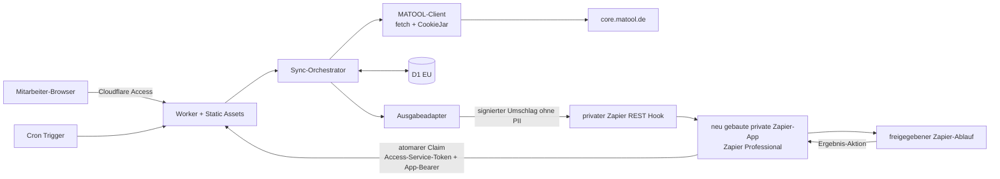
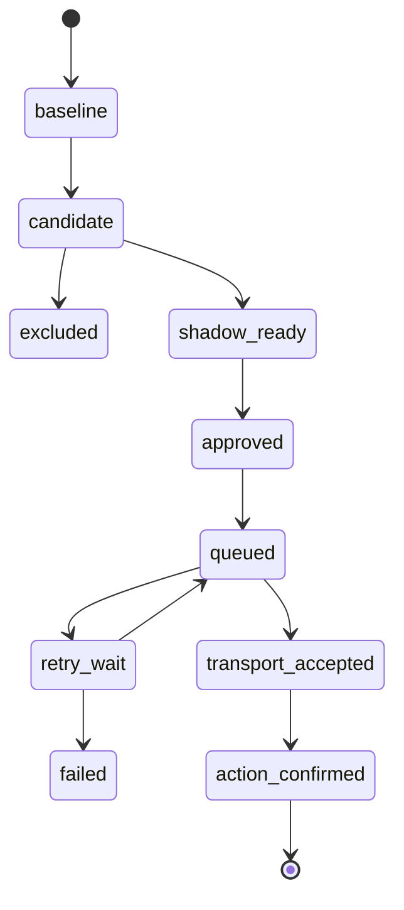

# Zielarchitektur

Status: Hosting, Oberfläche und erster Pilot bestätigt; fachliche Detailregeln offen<br>
Stand: 29. Juli 2026

## 1. Ziel

Die Anwendung bildet eine kontrollierte, versionierte Grenze zwischen MATOOL und
Zapier. Sie übernimmt drei Aufgaben:

1. technisch verifizierte MATOOL-Abrufe;
2. Validierung, Normalisierung und Änderungserkennung;
3. sichere Bereitstellung deduplizierter fachlicher Ereignisse.

Die Webseite ist ausschließlich ein internes Mitarbeiter-, Admin- und
Statuswerkzeug. Der erste Pilot erkennt Interessenten, die vor ihrem ersten
Probetraining kontaktiert werden sollen. Eine öffentliche
Vertragsverlängerungsseite und der GLZ-Prozess sind getrennt freizugebende
Ausbaustufen.

## 2. Systemübersicht



Der Quellcode liegt in GitHub. Cloudflare Workers Builds kann Commits aus dem
Repository bauen und als Version beziehungsweise Deployment veröffentlichen.
Der Zapier-Trigger ist ein in der privaten App definierter REST Hook mit
dynamischer An- und Abmeldung. Ein manuell konfigurierter Catch Hook und
Polling sind nicht Teil des Zielbilds.

## 3. Hostingentscheidung

Bestätigt ist ein Worker mit Static Assets:

- ein gemeinsames Deployment für Webseite, API und Cron;
- direkte Bindings an D1 und Secrets;
- keine Cross-Origin-Kommunikation zwischen Pages und Worker notwendig;
- identische Preview-Version für Frontend und Backend;
- weniger Konfiguration und weniger öffentliche Angriffsfläche.

Die nicht gewählte Alternative wäre ein Monorepo mit getrennten Deployments:

```text
apps/web       Cloudflare Pages
apps/worker    Cloudflare Worker mit Cron und D1
packages/core  gemeinsame Schemas und Fachlogik
```

Diese Alternative mit Cloudflare Pages besitzt zwei Deployments, benötigt eine
explizite Authentifizierung zwischen Pages und Worker und ist nicht Teil der
ersten Umsetzung.

## 4. Komponenten

### 4.1 Internes Mitarbeiter-Dashboard

Erster Umfang:

- Systemstatus ohne Personendaten;
- letzte Läufe mit Dauer und Mengen;
- Status des Interessenten-Collectors und Shadow-/Produktionsmodus;
- Fehlerkategorien mit redigierten Details;
- manueller Dry Run;
- Ereigniszähler und Zustellstatus.

Nicht vorgesehen:

- Anzeige kompletter MATOOL-Profile;
- Bearbeitung von MATOOL-Zugangsdaten im Browser;
- frei formulierbare MATOOL-Requests;
- Download von Roh-HTML oder Fotos.

Cloudflare Access wird nicht nur im Dashboard konfiguriert. Eine
Mitarbeiter-Anwendung schützt die gesamte Origin; eine spezifischere
Service-Anwendung schützt ausschließlich `/api/zapier/v1/*`. Beide besitzen
unterschiedliche Audience-Werte. Für geschützte Routen prüft der Worker das
`Cf-Access-Jwt-Assertion`-JWT auf Signatur, Aussteller, zur Route passende
Zielgruppe und Ablaufzeit. Static Assets müssen über `assets.run_worker_first`
ebenfalls durch diese Prüfung laufen. Die produktive `workers.dev`-Adresse wird
deaktiviert; Preview-URLs dürfen die Access-Grenze nicht umgehen.

### 4.2 MATOOL-Client

Der Client verwendet ausschließlich standardkonformes `fetch`:

1. Loginseite laden, falls der PoC dies als erforderlich bestätigt.
2. Cookies aus allen `Set-Cookie`-Antworten in einer laufbezogenen CookieJar
   übernehmen.
3. Formular-Login mit `mail` und `pass`, Redirect manuell prüfen.
4. Authentifizierte Folgeseite abrufen und ein stabiles Loginmerkmal prüfen.
5. Alle Collector-Requests mit derselben CookieJar ausführen.
6. Session am Laufende verwerfen.

Der Client bildet nur notwendige Browserkonventionen nach, beispielsweise
`Origin`, `Referer` und bei XHR `X-Requested-With`. Browserautomation wird erst
erwogen, wenn ein HTTP-only-PoC nachweislich nicht funktioniert.

### 4.3 Collector

Ein Collector definiert:

- Namen und Schemaversion;
- fachlichen Zweck und Feld-Whitelist;
- bestätigte Request-Sequenz;
- erwartete Antwortmerkmale;
- Parser, Pflichtfelder und Vollständigkeitsprüfung;
- stabilen Quellschlüssel;
- Hash- und Ereignisregeln;
- synthetische Fixtures;
- Aufbewahrungs- und Ausschlussregeln.

Collectors laufen innerhalb eines Kontos seriell, weil MATOOL-Endpunkte
Sessionzustand verändern können.

Der erste Collector erzeugt ausschließlich das Ereignis
`prospect.first_trial_contact_due`. Er benötigt mindestens eine stabile
Interessenten-ID, den nachweislich ersten Probetrainingstermin, den
Interessentenstatus und das Ergebnis der freigegebenen Kontaktprüfung. Das
Kontaktmedium, der Vorlauf vor dem Termin sowie Regeln für Absagen,
Verschiebungen und bereits kontaktierte Personen werden vor dem Shadow-Betrieb
fachlich festgelegt.

### 4.4 D1

D1 wird bei Erstellung auf `jurisdiction=eu` beschränkt. Vorgesehene Tabellen:

```text
process_config
runs
collector_state
records
events
outbox
deliveries
leases
zapier_subscriptions
delivery_tokens
event_claims
renewal_tokens   erst für eine öffentliche Verlängerungsseite
```

Wesentliche Constraints:

- `UNIQUE(collector, source_key)` auf `records`;
- `UNIQUE(event_id)` auf `events`;
- `UNIQUE(event_id, destination)` auf `outbox`;
- `UNIQUE(event_id, destination, attempt_number)` auf `deliveries`;
- genau ein `event_claims`-Datensatz je `event_id` und eine eindeutige
  `claim_id`;
- genau ein Delivery-Token je Outbox-Versuch; gespeichert wird nur
  `SHA-256(token)`, niemals der Klartexttoken;
- höchstens ein aktives `zapier_subscriptions`-Abonnement je Ereignistyp;
- atomarer Collector-Lease-Erwerb über eine bedingte D1-Schreiboperation mit
  `owner_run_id`, datenbankbasierter Ablaufzeit und monotonem `fencing_token`;
- Outbox-Lease, Versuchszähler, Delivery-Token und Nutzlastauswahl entstehen
  gemeinsam in genau einem D1-Batch; die Finalisierung prüft zusätzlich
  `lease_owner` und `attempt_count`;
- Statusfortschreibung und Outbox-Erzeugung in einer D1-Batch-Transaktion.

Es wird zunächst keine Read Replication aktiviert. Das kleine interne System
benötigt aktuelle, konsistente Daten stärker als globale Leselatenz.

Ein Collector-Lease ist nur gültig, wenn der bedingte Erwerb genau eine Zeile
ändert. Verlängerung und Freigabe prüfen den Owner. Record-, Event- und die
dazugehörige Outbox-Erzeugung prüfen zusätzlich den aktuellen Fencing-Token,
damit ein abgelaufener alter Lauf nach Start eines neuen Laufs nicht mehr
fortschreiben kann. Die Outbox-Zustellung besitzt davon getrennte, pro Versuch
erneuerte Leases. Cron, Dry Run und manueller Shadow-Lauf verwenden denselben
Collector-Lockpfad.

Die EU-Jurisdiktion begrenzt Laufzeit und Persistenz der D1-Datenbank. Sie
regionalisiert weder die globale Worker-Ausführung noch ausgehende Requests an
MATOOL oder Zapier. Diese Datenflüsse bleiben Teil der Datenschutz- und
Auftragsverarbeitungsprüfung.

### 4.5 Ausgabeadapter

Die Fachlogik kennt nur einen neutralen `EventSink`:

```text
deliver(envelope) -> accepted | retryable_error | permanent_error
```

Adapter:

1. `ShadowSink`: speichert und zeigt Ereignisse, sendet aber nichts.
2. `ZapierRestHookSink`: sendet ausschließlich einen signierten technischen
   Umschlag an das aktive, von Zapier bei der Subscription gelieferte Hook-Ziel.

Zapier Professional ist bestätigt. Die private App wird in diesem Projekt neu
gebaut. Google Sheets ist für den ersten Pilot weder Transport noch
Zustandsquelle.

#### Subscription

Beim Aktivieren eines Zaps ruft die private App die Middleware auf und
registriert die von Zapier bereitgestellte `target_url` für
`prospect.first_trial_contact_due`. Beim Deaktivieren wird genau diese
Subscription stillgelegt; offene Zustellungen an das deaktivierte Ziel werden
dauerhaft beendet. Die Zieladresse muss eine HTTPS-Adresse unter
`hooks.zapier.com` ohne Query oder Fragment sein. Sie wird in
`zapier_subscriptions` gespeichert, aber weder geloggt noch im Frontend
ausgegeben.

#### PII-freier Hook-Umschlag

Jeder Outbox-Versuch erzeugt einen neuen kryptografischen Delivery-Token und
sendet ausschließlich:

```text
schema_version
event_id
event_type
delivery_id
delivery_token
```

Der Umschlag enthält keine Namen, Kontaktwege, Termine, Standorte oder sonstige
Personendaten. Er wird mit HMAC-SHA-256 über Zeitstempel und kanonischen Body
signiert. Die private App verwirft ungültige, manipulierte oder zu alte
Umschläge. D1 speichert nur den Token-Hash und eine kurze Ablaufzeit; der
Klartexttoken existiert nur für die Zustellung.

Timeouts und andere wiederholbare Transportfehler sind ambig: Zapier kann den
Hook trotz verlorener Antwort angenommen haben. Nach dem letzten erlaubten
Versuch bleibt die Outbox deshalb bis zum Ablauf des bereits ausgegebenen
Delivery-Tokens in einer Claim-Wartephase. Ein verspäteter gültiger Claim wird
weiterhin angenommen. Erst ohne Claim nach Tokenablauf wird der Vorgang
dauerhaft beendet. Ein eindeutiger permanenter 4xx beendet einen ersten Versuch
sofort. Existiert jedoch noch ein gültiger Token aus einem älteren ambigen oder
akzeptierten Versuch, kann der spätere 4xx dessen Verarbeitung nicht
widerlegen: Die Middleware nimmt den älteren Claim bis zum Ablauf aller noch
gültigen Tokens an und beendet den Vorgang erst danach.

#### Atomarer Claim und Ergebnis

Nach einem gültigen Hook ruft die private App
`POST /api/zapier/v1/events/claim` mit `event_id`, `delivery_id` und
`delivery_token` auf. Eine bedingte D1-Schreiboperation legt höchstens einen
Claim je `event_id` an. Nur der erste gültige Claim erhält die minimierte,
fachlich freigegebene Ereignisnutzlast und eine `claim_id`; Wiederholungen
liefern kein zweites Trigger-Ereignis.

Der letzte Schritt des Zaps verwendet die private App-Aktion
„Kontakt-Ergebnis melden“. Sie sendet `event_id`, `claim_id`, `outcome` und
optional einen technischen `failure_code` ohne Personen- oder
Nachrichteninhalt. Gleichlautende Wiederholungen sind idempotent; ein
widersprüchliches Ergebnis wird abgewiesen. Erst `outcome=succeeded` setzt das
Ereignis auf `action_confirmed`.

Ein verlorener Claim-Response darf keinen zweiten Claim erzeugen. Der Vorgang
bleibt stattdessen unbestätigt und muss nach `review_after` kontrolliert
aufgearbeitet werden. Claim und Ergebnisbestätigung reduzieren
Doppeltrigger, machen eine nicht-idempotente externe Zielaktion bei deren
eigenem Retry jedoch nicht rückwirkend exakt-einmalig. Wo das Ziel einen
Idempotenzschlüssel unterstützt, verwendet der Zap deshalb `event_id`
beziehungsweise `claim_id`.

Der aktuelle Sicherheitsstatus bleibt deshalb zweigeteilt:

- `claimGuardImplemented = true`: Hook-Retrys können für dieselbe `event_id`
  keinen zweiten Zap-Start auslösen.
- `targetDedupeVerified = false`: Für eine ambige Provider-Antwort, einen Retry
  der eigentlichen E-Mail-/SMS-Aktion oder eine manuelle Zap-Wiederholung ist
  die Idempotenz des Kontaktziels noch nicht nachgewiesen.

Produktive Kundenaktionen bleiben gesperrt, bis der zweite Punkt für das
gewählte Zielsystem verifiziert ist.

#### Service-Authentifizierung

Alle Aufrufe der privaten App an `/api/zapier/v1/*` durchlaufen zwei
unabhängige Prüfungen:

1. Cloudflare Access validiert `CF-Access-Client-Id` und
   `CF-Access-Client-Secret` eines eng begrenzten Service-Tokens gegen die nur
   für `/api/zapier/v1/*` geltende Access-Anwendung.
2. Der Worker validiert zusätzlich `Authorization: Bearer ...` gegen den
   umgebungsspezifischen App-Service-Token.

Die Service-Anwendung besitzt eine andere Audience als die
Mitarbeiter-Anwendung. Der Worker verwendet `ACCESS_SERVICE_AUD` ausschließlich
für die Zapier-Routen und `ACCESS_AUD` für Dashboard, Assets und Admin-API; eine
identische Service-Audience wird als Fehlkonfiguration abgewiesen.

Ein Mitarbeiter-JWT benötigt ein nicht leeres `sub`. Ein Service-JWT besitzt
Cloudflare-konform ein leeres `sub` und wird stattdessen über den signierten
`common_name` als Service-Token erkannt. Beide Claimformen sind nur im
zugehörigen Scope zulässig.

Die HMAC-Signatur des ausgehenden Hook-Umschlags ist davon getrennt. Keines
dieser Secrets oder die Zapier-Zieladresse darf an Browsercode, Logs oder
Fehlerantworten gelangen.

Die Middleware-Origin ist kein frei eingebbares Verbindungsfeld. Sie wird je
privater App-Version als `MATOOL_MIDDLEWARE_ORIGIN` fest angeheftet; die
Request-Middleware setzt die Zugangsdaten nur bei exakter Übereinstimmung und
folgt keinen Redirects. Staging und Produktion erhalten getrennte Origins.

Die REST-Hook- und Claim-Schnittstelle kann vollständig mit synthetischen
Ereignissen getestet werden. Ihre Existenz belegt ausdrücklich noch keine
MATOOL-Feldzuordnung: Interessenten-ID, Termin-ID, erster
Probetrainingstermin, Status und Kontaktfreigabe bleiben Gates des Collectors.

## 5. Zeitsteuerung

Ein Cron Trigger startet regelmäßige Interessenten-Abrufe. Die fachliche
Eignungsprüfung verwendet Datum und Uhrzeit des ersten Probetrainings in
`Europe/Berlin`; UTC-Zeitstempel allein dürfen keine Verschiebung des lokalen
Kontakttags verursachen.

Vor Aktivierung des Cron werden festgelegt:

- gewünschter Vorlauf vor dem ersten Probetraining;
- zulässige Kontaktzeiten und Wochentage;
- Verhalten bei ausgefallenen Läufen;
- Lookback-Fenster für verschobene oder nachträglich eingetragene Termine.

Der Cron darf breiter als das fachliche Kontaktfenster laufen. Eine lokale
Prüfung erfolgt vor Login, Lease, Datenzugriff und Ereigniserzeugung. Als
Zeitquelle dient ausschließlich `controller.scheduledTime`, damit eine verspätete
tatsächliche Ausführung das fachliche Fenster nicht verändert. Wiederholte
Läufe erzeugen aufgrund derselben `event_id` keine zweite Kontaktaktion.

## 6. Zustands- und Fehlersemantik



Regeln:

- `baseline` erzeugt standardmäßig keine ausgehenden Ereignisse.
- `unchanged` ist ein Laufergebnis, kein gespeicherter Ereignisstatus.
- Ein unveränderter Datensatz erzeugt weder neue Version noch neue Zustellung.
- Leere oder stark verkleinerte Antworten sind Fehler, keine Löschung.
- Ein Collector-Fehler verhindert die Zustandsfortschreibung dieses Collectors.
- Retrys verwenden Backoff und eine maximale Versuchszahl.
- Ein letzter ambiger Transportversuch bleibt bis zum Ablauf seines
  Delivery-Tokens claimbar und wird nicht bereits beim Lease-Ablauf
  terminalisiert.
- Dauerfehler werden sichtbar pausiert; sie erzeugen keine Endlosschleife.
- `transport_accepted` bestätigt nur den HTTP-Transport des PII-freien
  Umschlags. Ein Claim kann während der Hook-Verarbeitung bereits vor der
  lokalen Verbuchung dieses 2xx erfolgen und wird deshalb separat in
  `event_claims` geführt.
- Ein gültiger Delivery-Token kann die Ereignisnutzlast nur beim ersten
  atomaren Claim freigeben; `already_claimed` und `already_confirmed` starten
  keinen weiteren Zap.
- `action_confirmed` entsteht ausschließlich durch die authentifizierte
  Ergebnis-Aktion mit passender `event_id` und `claim_id`.

## 7. API-Grenzen

Alle Antworten enthalten eine Schemaversion.

```text
GET  /healthz                         minimal, keine Bindungs- oder Personendaten
GET  /api/admin/v1/status             Cloudflare Access
GET  /api/admin/v1/runs               Cloudflare Access
GET  /api/admin/v1/events             Cloudflare Access, Werte maskiert
POST /api/admin/v1/sync/dry-run       Cloudflare Access + CSRF-Schutz
POST /api/admin/v1/sync/shadow        Cloudflare Access + CSRF-Schutz
```

Die entschiedene Service-Grenze der privaten Zapier-App lautet:

```text
GET    /api/zapier/v1/account               Verbindung prüfen
POST   /api/zapier/v1/subscriptions         REST Hook abonnieren
DELETE /api/zapier/v1/subscriptions/:id     REST Hook abbestellen
POST   /api/zapier/v1/events/sample         synthetisches Editor-Beispiel
POST   /api/zapier/v1/events/claim          Ereignis einmalig beanspruchen
POST   /api/zapier/v1/events/confirm        Ergebnis-Aktion bestätigen
```

Jede dieser Routen verlangt ein JWT der pfadgenauen
Cloudflare-Access-Service-Anwendung und den unabhängigen App-Bearer-Token. Sie
akzeptieren nur kleine, für die
`/api/zapier/v1`-Grenze fest definierte JSON-Objekte. Der von der Middleware
ausgehende REST Hook ist kein
öffentlicher Middleware-Endpunkt, sondern die bei der Subscription von Zapier
gelieferte Zieladresse.

## 8. Deployment und Umgebungen

Mindestens zwei getrennte Umgebungen:

- `staging`: synthetische Fixtures, später optional ein realer read-only Test;
- `production`: eigene D1-Datenbank, eigene Secrets und explizit aktivierter
  Cron.

Staging und Produktion sind getrennte Worker mit getrennten D1-Datenbanken,
Secrets, Access-Anwendungen und Cron-Konfigurationen. Nicht-produktive Branches
werden ausdrücklich gegen den Staging-Worker gebaut, beispielsweise mit
`wrangler versions upload --env staging`; sie laden keine Version mit
Produktionsbindungen hoch. Ein Preview-Deployment erhält niemals produktive
MATOOL-Secrets, Access-Service-Token, App-Bearer-Token,
Webhook-Signierschlüssel oder produktive Zapier-Subscriptions.

## 9. Kapazitätsrisiko

Die aufgezeichneten Schüler- und Interessentenseiten sind ungefähr 0,8 bis
1,0 MB groß. HTML-Parsing kann die CPU-Grenze des Workers Free Plans
überschreiten. Der Machbarkeits-PoC misst:

- CPU- und Wall-Time;
- Antwortgröße;
- MATOOL-Subrequests;
- Kandidatenzahl;
- Parser-Speicher;
- externes Subrequest-Budget einschließlich Login, Redirects und Collector.

Im Free Plan sind höchstens 50 externe Subrequests pro Invocation erlaubt;
jeder Redirect-Schritt zählt mit. Der PoC muss mit Sicherheitsreserve deutlich
darunter bleiben. Benötigt ein fachlich vollständiger Lauf 50 oder mehr
Subrequests, wird er nicht im Free Plan aktiviert; dann werden Paid oder eine
fachlich sichere Aufteilung bewertet. Ein Wechsel erfolgt auf Messwerten, nicht
vorsorglich.

## 10. Referenzen

- https://developers.cloudflare.com/workers/best-practices/workers-best-practices/
- https://developers.cloudflare.com/workers/static-assets/
- https://developers.cloudflare.com/workers/ci-cd/builds/
- https://developers.cloudflare.com/workers/configuration/cron-triggers/
- https://developers.cloudflare.com/workers/platform/limits/
- https://developers.cloudflare.com/cloudflare-one/access-controls/applications/http-apps/authorization-cookie/validating-json/
- https://developers.cloudflare.com/d1/configuration/data-location/
- https://developers.cloudflare.com/d1/worker-api/d1-database/
