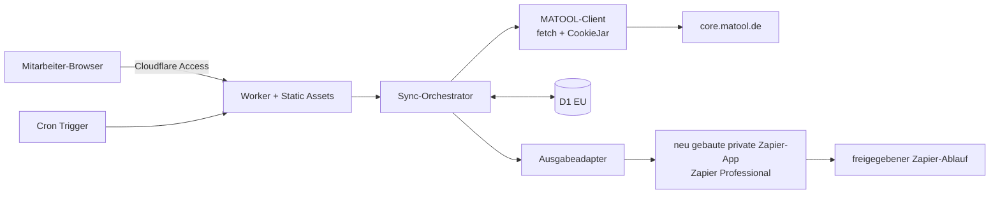
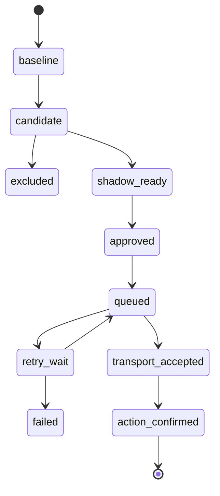

# Zielarchitektur

Status: Hosting, Oberfläche und erster Pilot bestätigt; fachliche Detailregeln offen<br>
Stand: 29. Juli 2026

## 1. Ziel

Die Anwendung bildet eine kontrollierte, versionierte Grenze zwischen MATOOL und
Zapier. Sie übernimmt drei Aufgaben:

1. technisch verifizierte MATOOL-Abrufe;
2. Validierung, Normalisierung und Änderungserkennung;
3. sichere Bereitstellung deduplizierter fachlicher Ereignisse.

Die Webseite ist ausschließlich ein internes Mitarbeiter-, Admin- und
Statuswerkzeug. Der erste Pilot erkennt Interessenten, die vor ihrem ersten
Probetraining kontaktiert werden sollen. Eine öffentliche
Vertragsverlängerungsseite und der GLZ-Prozess sind getrennt freizugebende
Ausbaustufen.

## 2. Systemübersicht



Der Quellcode liegt in GitHub. Cloudflare Workers Builds kann Commits aus dem
Repository bauen und als Version beziehungsweise Deployment veröffentlichen.

## 3. Hostingentscheidung

Bestätigt ist ein Worker mit Static Assets:

- ein gemeinsames Deployment für Webseite, API und Cron;
- direkte Bindings an D1 und Secrets;
- keine Cross-Origin-Kommunikation zwischen Pages und Worker notwendig;
- identische Preview-Version für Frontend und Backend;
- weniger Konfiguration und weniger öffentliche Angriffsfläche.

Die nicht gewählte Alternative wäre ein Monorepo mit getrennten Deployments:

```text
apps/web       Cloudflare Pages
apps/worker    Cloudflare Worker mit Cron und D1
packages/core  gemeinsame Schemas und Fachlogik
```

Diese Alternative mit Cloudflare Pages besitzt zwei Deployments, benötigt eine
explizite Authentifizierung zwischen Pages und Worker und ist nicht Teil der
ersten Umsetzung.

## 4. Komponenten

### 4.1 Internes Mitarbeiter-Dashboard

Erster Umfang:

- Systemstatus ohne Personendaten;
- letzte Läufe mit Dauer und Mengen;
- Status des Interessenten-Collectors und Shadow-/Produktionsmodus;
- Fehlerkategorien mit redigierten Details;
- manueller Dry Run;
- Ereigniszähler und Zustellstatus.

Nicht vorgesehen:

- Anzeige kompletter MATOOL-Profile;
- Bearbeitung von MATOOL-Zugangsdaten im Browser;
- frei formulierbare MATOOL-Requests;
- Download von Roh-HTML oder Fotos.

Cloudflare Access wird nicht nur im Dashboard konfiguriert. Für geschützte
Routen prüft der Worker das `Cf-Access-Jwt-Assertion`-JWT auf Signatur,
Aussteller, Zielgruppe und Ablaufzeit. Static Assets müssen über
`assets.run_worker_first` ebenfalls durch diese Prüfung laufen. Die produktive
`workers.dev`-Adresse wird deaktiviert oder gleichwertig geschützt; Preview-URLs
dürfen die Access-Grenze nicht umgehen.

### 4.2 MATOOL-Client

Der Client verwendet ausschließlich standardkonformes `fetch`:

1. Loginseite laden, falls der PoC dies als erforderlich bestätigt.
2. Cookies aus allen `Set-Cookie`-Antworten in einer laufbezogenen CookieJar
   übernehmen.
3. Formular-Login mit `mail` und `pass`, Redirect manuell prüfen.
4. Authentifizierte Folgeseite abrufen und ein stabiles Loginmerkmal prüfen.
5. Alle Collector-Requests mit derselben CookieJar ausführen.
6. Session am Laufende verwerfen.

Der Client bildet nur notwendige Browserkonventionen nach, beispielsweise
`Origin`, `Referer` und bei XHR `X-Requested-With`. Browserautomation wird erst
erwogen, wenn ein HTTP-only-PoC nachweislich nicht funktioniert.

### 4.3 Collector

Ein Collector definiert:

- Namen und Schemaversion;
- fachlichen Zweck und Feld-Whitelist;
- bestätigte Request-Sequenz;
- erwartete Antwortmerkmale;
- Parser, Pflichtfelder und Vollständigkeitsprüfung;
- stabilen Quellschlüssel;
- Hash- und Ereignisregeln;
- synthetische Fixtures;
- Aufbewahrungs- und Ausschlussregeln.

Collectors laufen innerhalb eines Kontos seriell, weil MATOOL-Endpunkte
Sessionzustand verändern können.

Der erste Collector erzeugt ausschließlich das Ereignis
`prospect_trial_contact_due`. Er benötigt mindestens eine stabile
Interessenten-ID, den nachweislich ersten Probetrainingstermin, den
Interessentenstatus und das Ergebnis der freigegebenen Kontaktprüfung. Das
Kontaktmedium, der Vorlauf vor dem Termin sowie Regeln für Absagen,
Verschiebungen und bereits kontaktierte Personen werden vor dem Shadow-Betrieb
fachlich festgelegt.

### 4.4 D1

D1 wird bei Erstellung auf `jurisdiction=eu` beschränkt. Vorgesehene Tabellen:

```text
runs
collector_state
records
events
outbox
deliveries
leases
renewal_tokens   erst für eine öffentliche Verlängerungsseite
```

Wesentliche Constraints:

- `UNIQUE(collector, source_key)` auf `records`;
- `UNIQUE(event_id)` auf `events`;
- `UNIQUE(event_id, destination)` auf `deliveries`;
- atomarer Lease-Erwerb über eine bedingte D1-Schreiboperation mit
  `owner_run_id`, datenbankbasierter Ablaufzeit und monotonem `fencing_token`;
- Statusfortschreibung und Outbox-Erzeugung in einer D1-Batch-Transaktion.

Es wird zunächst keine Read Replication aktiviert. Das kleine interne System
benötigt aktuelle, konsistente Daten stärker als globale Leselatenz.

Ein Lease ist nur gültig, wenn der bedingte Erwerb genau eine Zeile ändert.
Verlängerung und Freigabe prüfen den Owner. Jeder Record-, Event- und
Outbox-Schreibpfad prüft zusätzlich den aktuellen Fencing-Token, damit ein
abgelaufener alter Lauf nach Start eines neuen Laufs nicht mehr fortschreiben
kann. Cron, Dry Run und manueller Shadow-Lauf verwenden denselben Lockpfad.

Die EU-Jurisdiktion begrenzt Laufzeit und Persistenz der D1-Datenbank. Sie
regionalisiert weder die globale Worker-Ausführung noch ausgehende Requests an
MATOOL oder Zapier. Diese Datenflüsse bleiben Teil der Datenschutz- und
Auftragsverarbeitungsprüfung.

### 4.5 Ausgabeadapter

Die Fachlogik kennt nur einen neutralen `EventSink`:

```text
deliver(event) -> accepted | retryable_error | permanent_error
```

Geplante Adapter:

1. `ShadowSink`: speichert und zeigt Ereignisse, sendet aber nichts.
2. `ZapierAppSink`: stellt freigegebene Ereignisse der neu zu bauenden privaten
   Zapier-App bereit beziehungsweise stellt sie an diese zu.

Zapier Professional ist bestätigt. Die private App wird in diesem Projekt neu
gebaut; sie verwendet die `event_id` als stabilen
Zapier-Deduplizierungsschlüssel und authentifiziert sich an einer eng begrenzten
Service-API. Google Sheets ist für den ersten Pilot weder Transport noch
Zustandsquelle.

## 5. Zeitsteuerung

Ein Cron Trigger startet regelmäßige Interessenten-Abrufe. Die fachliche
Eignungsprüfung verwendet Datum und Uhrzeit des ersten Probetrainings in
`Europe/Berlin`; UTC-Zeitstempel allein dürfen keine Verschiebung des lokalen
Kontakttags verursachen.

Vor Aktivierung des Cron werden festgelegt:

- gewünschter Vorlauf vor dem ersten Probetraining;
- zulässige Kontaktzeiten und Wochentage;
- Verhalten bei ausgefallenen Läufen;
- Lookback-Fenster für verschobene oder nachträglich eingetragene Termine.

Der Cron darf breiter als das fachliche Kontaktfenster laufen. Eine lokale
Prüfung erfolgt vor Login, Lease, Datenzugriff und Ereigniserzeugung. Als
Zeitquelle dient ausschließlich `controller.scheduledTime`, damit eine verspätete
tatsächliche Ausführung das fachliche Fenster nicht verändert. Wiederholte
Läufe erzeugen aufgrund derselben `event_id` keine zweite Kontaktaktion.

## 6. Zustands- und Fehlersemantik



Regeln:

- `baseline` erzeugt standardmäßig keine ausgehenden Ereignisse.
- `unchanged` ist ein Laufergebnis, kein gespeicherter Ereignisstatus.
- Ein unveränderter Datensatz erzeugt weder neue Version noch neue Zustellung.
- Leere oder stark verkleinerte Antworten sind Fehler, keine Löschung.
- Ein Collector-Fehler verhindert die Zustandsfortschreibung dieses Collectors.
- Retrys verwenden Backoff und eine maximale Versuchszahl.
- Dauerfehler werden sichtbar pausiert; sie erzeugen keine Endlosschleife.

## 7. Vorgeschlagene API-Grenzen

Alle Antworten enthalten eine Schemaversion.

```text
GET  /healthz                         minimal, keine Bindungs- oder Personendaten
GET  /api/admin/v1/status             Cloudflare Access
GET  /api/admin/v1/runs               Cloudflare Access
GET  /api/admin/v1/events             Cloudflare Access, Werte maskiert
POST /api/admin/v1/sync/dry-run       Cloudflare Access + CSRF-Schutz
POST /api/admin/v1/sync/shadow        Cloudflare Access + CSRF-Schutz
```

Die private Zapier-App erhält eine versionierte Service-Grenze mit eigener
Authentifizierung. Ob sie Ereignisse per REST Hook empfängt oder kontrolliert
pollt, wird vor ihrer Implementierung festgelegt; beide Varianten verwenden
`event_id` und ein explizites Zustellprotokoll.

## 8. Deployment und Umgebungen

Mindestens zwei getrennte Umgebungen:

- `staging`: synthetische Fixtures, später optional ein realer read-only Test;
- `production`: eigene D1-Datenbank, eigene Secrets und explizit aktivierter
  Cron.

Staging und Produktion sind getrennte Worker mit getrennten D1-Datenbanken,
Secrets, Access-Anwendungen und Cron-Konfigurationen. Nicht-produktive Branches
werden ausdrücklich gegen den Staging-Worker gebaut, beispielsweise mit
`wrangler versions upload --env staging`; sie laden keine Version mit
Produktionsbindungen hoch. Ein Preview-Deployment erhält niemals produktive
MATOOL-Secrets oder produktive Zugangsdaten der privaten Zapier-App.

## 9. Kapazitätsrisiko

Die aufgezeichneten Schüler- und Interessentenseiten sind ungefähr 0,8 bis
1,0 MB groß. HTML-Parsing kann die CPU-Grenze des Workers Free Plans
überschreiten. Der Machbarkeits-PoC misst:

- CPU- und Wall-Time;
- Antwortgröße;
- MATOOL-Subrequests;
- Kandidatenzahl;
- Parser-Speicher;
- externes Subrequest-Budget einschließlich Login, Redirects und Collector.

Im Free Plan sind höchstens 50 externe Subrequests pro Invocation erlaubt;
jeder Redirect-Schritt zählt mit. Der PoC muss mit Sicherheitsreserve deutlich
darunter bleiben. Benötigt ein fachlich vollständiger Lauf 50 oder mehr
Subrequests, wird er nicht im Free Plan aktiviert; dann werden Paid oder eine
fachlich sichere Aufteilung bewertet. Ein Wechsel erfolgt auf Messwerten, nicht
vorsorglich.

## 10. Referenzen

- https://developers.cloudflare.com/workers/best-practices/workers-best-practices/
- https://developers.cloudflare.com/workers/static-assets/
- https://developers.cloudflare.com/workers/ci-cd/builds/
- https://developers.cloudflare.com/workers/configuration/cron-triggers/
- https://developers.cloudflare.com/workers/platform/limits/
- https://developers.cloudflare.com/cloudflare-one/access-controls/applications/http-apps/authorization-cookie/validating-json/
- https://developers.cloudflare.com/d1/configuration/data-location/
- https://developers.cloudflare.com/d1/worker-api/d1-database/
